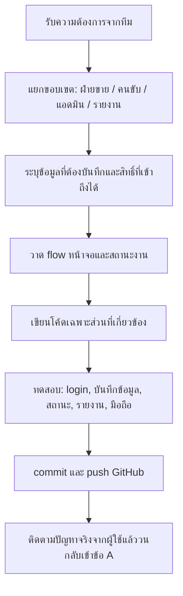
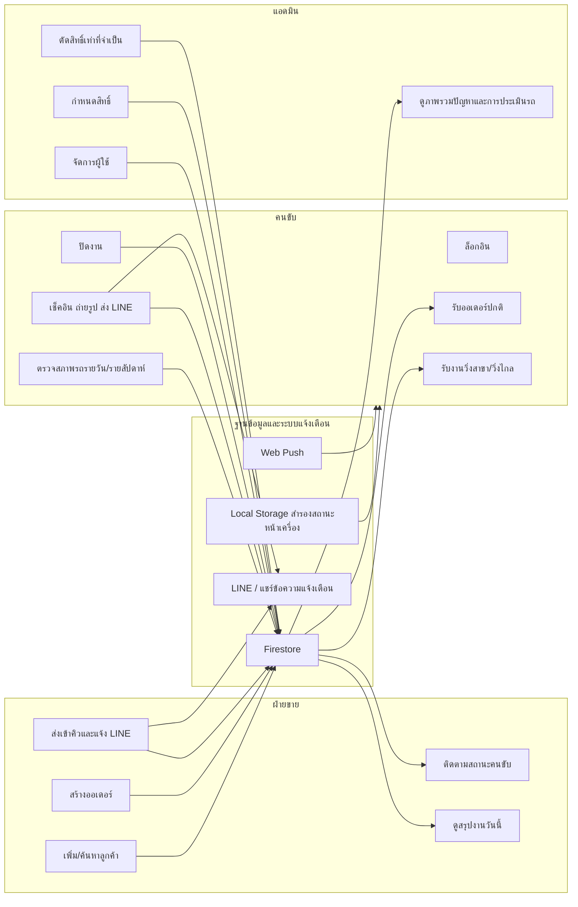
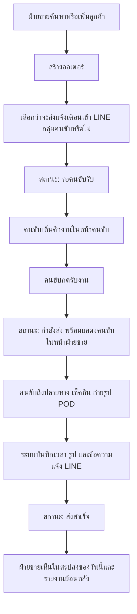
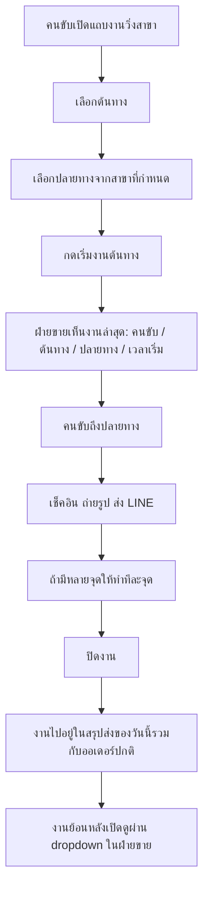
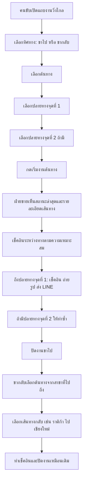
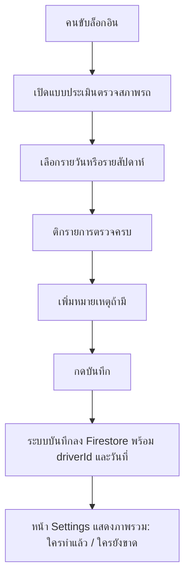
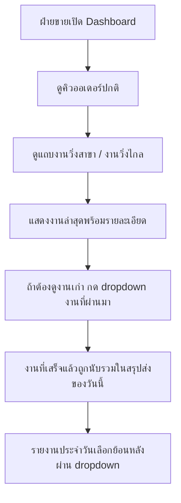
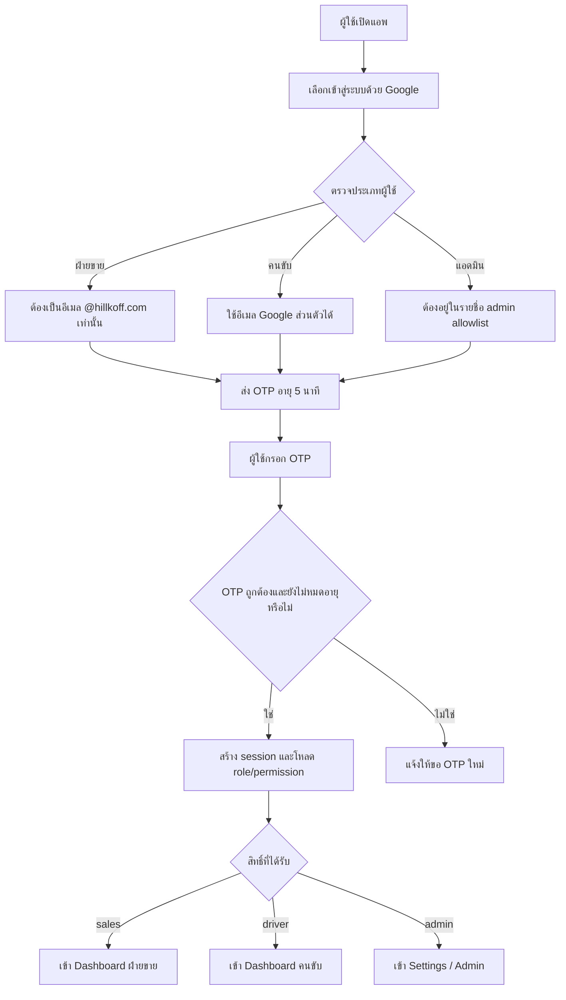
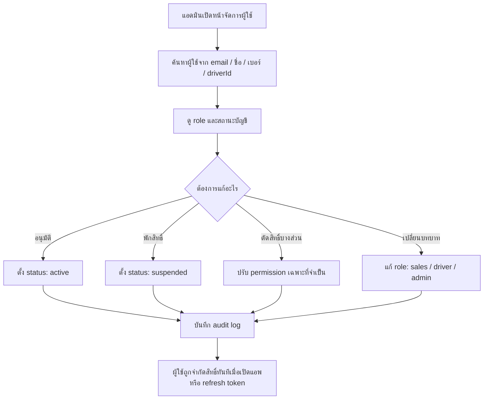
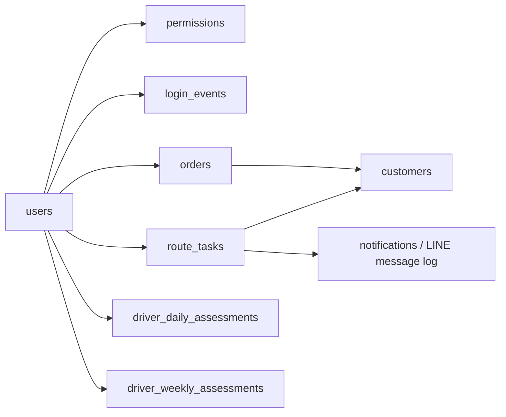

# Hillkoff Driver App - System Workflow 2026

เอกสารนี้ใช้เป็น workflow กลางก่อนลงมือพัฒนาเพิ่มเติม เพื่อให้ทีมเห็นภาพระบบทั้งฝ่ายขาย คนขับ และแอดมินชัดเจน ลดการแก้แบบวนไปมา และช่วยให้การเพิ่มฟีเจอร์ใหม่ไม่กระทบงานเดิม

## 1. หลักการทำงานก่อนเขียนโค้ด

กติกาหลัก: ทุกครั้งที่เพิ่มฟีเจอร์ ให้ระบุให้ได้ก่อนว่าใครใช้, เห็นข้อมูลอะไร, กดแล้วสถานะเปลี่ยนเป็นอะไร, และฝ่ายขาย/แอดมินเห็นผลอย่างไร

## 2. ภาพรวมระบบ

## 3. Workflow ออเดอร์ปกติ

## 4. Workflow งานวิ่งสาขา

งานวิ่งสาขาเป็นงานที่คนขับเลือกเองจากหน้าคนขับ โดยแยกจากออเดอร์ปกติ แต่ฝ่ายขายต้องเห็นสถานะทันทีตั้งแต่เริ่มงานต้นทาง

สาขาหลักที่ใช้ใน flow:
- สาขาช้างเผือก
- สาขาโรงงานป่าแพ่ง
- สาขาสำนักงานใหญ่
- สาขามหิดล
- สาขาทับเดื่อ

## 5. Workflow งานวิ่งไกล

งานวิ่งไกลรองรับทั้งไปสาขาเดียว และไปรอบเดียวกันสองปลายทาง เช่น หอมไกลและราติก้า

ปลายทางงานวิ่งไกล:
- ร้านหอมไกล จ.ชลบุรี
- สาขาราติก้า จ.กรุงเทพมหานคร
- เชียงใหม่ สำหรับงานขากลับ

## 6. Workflow ตรวจสภาพรถ

จุดที่ต้องคุมต่อ:
- iPhone และ Android ต้องกดบันทึกได้เหมือนกัน
- รายสัปดาห์ต้องมีปุ่มบันทึกชัดเจน
- แอดมินและฝ่ายขายควรดูภาพรวมได้ แต่คนขับเห็นเฉพาะของตัวเอง

## 7. Workflow สถานะในหน้าฝ่ายขาย

ข้อมูลที่ฝ่ายขายควรเห็นทันที:
- คนขับคนไหนเริ่มงาน
- ต้นทางและปลายทาง
- เวลาเริ่มงาน
- จุดเช็คอินล่าสุด
- รูปหลักฐานเมื่อถึงปลายทาง
- สถานะจบงาน

## 8. Workflow Login และสิทธิ์ผู้ใช้ที่จะพัฒนาต่อ

เป้าหมายคือเปลี่ยนจาก login แบบเบอร์/รหัส ไปเป็น Google login พร้อม OTP อายุ 5 นาที คล้ายระบบที่เคยทำใน ESG zerowaste

เงื่อนไขสำคัญ:
- ฝ่ายขาย: อนุญาตเฉพาะ Google account ที่ลงท้ายด้วย `@hillkoff.com`
- คนขับ: อนุญาต Google account ส่วนตัว แต่ต้องผูกกับ driver profile ที่แอดมินอนุมัติ
- แอดมิน: ต้องอยู่ใน allowlist และมีสิทธิ์จัดการผู้ใช้
- OTP: อายุ 5 นาที, ใช้ได้ครั้งเดียว, บันทึกเวลาขอและเวลายืนยัน
- หลัง login สำเร็จต้องบันทึก `uid`, `email`, `role`, `driverId`, `status`, `lastLoginAt`

## 9. Workflow แอดมินจัดการสิทธิ์

สิทธิ์ที่ควรแยก:
- `orders.read`
- `orders.write`
- `orders.assign`
- `routeTasks.read`
- `routeTasks.write`
- `customers.read`
- `customers.write`
- `drivers.read`
- `drivers.write`
- `assessments.read`
- `assessments.write`
- `reports.read`
- `settings.read`
- `users.manage`
- `permissions.manage`

## 10. ตารางสิทธิ์เบื้องต้น

| ส่วนงาน | ฝ่ายขาย | คนขับ | แอดมิน |
| --- | --- | --- | --- |
| ดูลูกค้า | ได้ | เฉพาะงานที่เกี่ยวข้อง | ได้ |
| เพิ่ม/แก้ลูกค้า | ได้ | ไม่ได้ | ได้ |
| สร้างออเดอร์ | ได้ | ไม่ได้ | ได้ |
| รับงานออเดอร์ | ไม่ได้ | ได้ | ได้เฉพาะแก้ไขฉุกเฉิน |
| งานวิ่งสาขา/วิ่งไกล | ดูสถานะ | เริ่มงาน/เช็คอิน/ปิดงาน | ดูและแก้ไขได้ |
| ตรวจสภาพรถ | ดูรายงาน | ทำแบบประเมินของตัวเอง | ดูทั้งหมด |
| รายงานประจำวัน | ได้ | เฉพาะของตัวเอง | ได้ |
| ตั้งค่า/จัดการสิทธิ์ | ไม่ได้ | ไม่ได้ | ได้ |

## 11. ข้อมูลหลักที่ควรมีใน Firestore

Collection ที่ควรเตรียม:
- `users`: บัญชี, role, status, email, phone, driverId
- `permissions`: สิทธิ์รายบุคคลหรือราย role
- `otp_sessions`: OTP hash, expiresAt, usedAt, uid/email
- `login_events`: ประวัติ login และ device
- `customers`: ลูกค้า
- `orders`: ออเดอร์ปกติ
- `route_tasks`: งานวิ่งสาขาและวิ่งไกล
- `driver_daily_assessments`: ตรวจสภาพรถรายวัน
- `driver_weekly_assessments`: ตรวจสภาพรถรายสัปดาห์
- `notifications`: ประวัติ push/LINE/share message
- `audit_logs`: ประวัติแอดมินแก้ role/permission/status

## 12. Roadmap การพัฒนาต่อ

### Phase 1: ทำระบบบัญชีให้ชัด
- เพิ่ม Google login
- เพิ่ม OTP 5 นาที
- สร้าง `users`, `otp_sessions`, `audit_logs`
- บังคับฝ่ายขายใช้ `@hillkoff.com`
- ให้คนขับผูก Google ส่วนตัวกับ driver profile

### Phase 2: ทำสิทธิ์จริง
- เพิ่ม permission matrix
- จำกัดหน้าและ API ตาม role
- เพิ่มปุ่มแอดมินสำหรับ active/suspended
- บันทึก audit log ทุกครั้งที่แก้สิทธิ์

### Phase 3: ทำรายงานให้เป็นระบบ
- รวมออเดอร์ปกติ งานวิ่งสาขา งานวิ่งไกล ใน summary เดียว
- แยกดูย้อนหลังผ่าน dropdown
- เพิ่มรายงานตรวจสภาพรถรายวัน/รายสัปดาห์
- เพิ่มรายงานปัญหาและความต่อเนื่องของแอพ

### Phase 4: แข็งแรงสำหรับใช้งานจริง
- ตรวจ Firestore rules ให้ตรงกับ role/permission
- ทดสอบ iPhone/Android ก่อนปล่อยจริง
- ทดสอบ offline/online sync
- ทดสอบ LINE share และ push notification
- เพิ่ม backup และ recovery checklist

## 13. Checklist ก่อนเริ่มฟีเจอร์ใหม่ทุกครั้ง

- ระบุผู้ใช้หลักของฟีเจอร์
- ระบุหน้าจอที่เกี่ยวข้อง
- ระบุ collection/document ที่ต้องอ่านเขียน
- ระบุสถานะก่อนกดและหลังกด
- ระบุว่าฝ่ายขายเห็นอะไร
- ระบุว่าคนขับเห็นอะไร
- ระบุว่าแอดมินควบคุมสิทธิ์อะไรได้
- ระบุผลกระทบต่อรายงาน
- ทดสอบมือถืออย่างน้อย iPhone และ Android
- commit/push หลังทดสอบผ่าน
